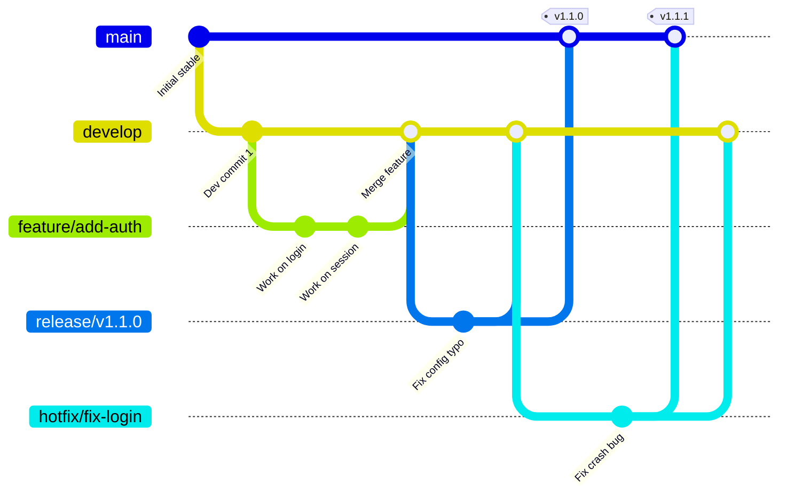

# Panduan Kontribusi & Strategi Percabangan (Branch Strategy)

Selamat datang di tim pengembang **fmikom-portal**! Panduan ini dirancang untuk menyamakan persepsi alur kerja git, konvensi kode, dan proses kolaborasi di repositori ini.

---

## 🛠️ Strategi Percabangan (Branching Strategy)

Kami menerapkan model alur kerja Git Flow yang disederhanakan dengan cabang-cabang berikut:



### 1. `main` (Cabang Produksi)
* **Tujuan:** Menyimpan kode stabil yang sudah siap digunakan oleh pengguna akhir (production-ready).
* **Aturan:** 
  * **Tidak boleh** ada commit langsung ke `main`.
  * Kode hanya masuk ke `main` via Merge Request dari cabang `release/*` atau `hotfix/*`.
  * Setiap commit di `main` harus ditandai dengan label versi (Git Tag), misalnya `v1.0.0`.

### 2. `develop` (Cabang Pengembangan Utama)
* **Tujuan:** Cabang integrasi harian bagi seluruh fitur yang telah selesai didevelop.
* **Aturan:**
  * Semua fitur baru (`feature/*`) akan digabungkan ke cabang ini.
  * Harus selalu lolos uji coba otomatis (CI/CD Tests) sebelum bisa digabungkan ke `main`.

### 3. `feature/*` (Cabang Fitur Baru)
* **Format Penamaan:** `feature/nama-fitur` atau `feature/nomor-issue-nama` (contoh: `feature/absensi-wims` atau `feature/12-sso-login`).
* **Tujuan:** Tempat pengerjaan fitur baru secara mandiri tanpa mengganggu pengembang lain.
* **Aturan:**
  * Dibuat dari cabang `develop`.
  * Setelah pengerjaan selesai, buat **Pull Request (PR)** kembali ke cabang `develop`.

### 4. `release/*` (Cabang Persiapan Rilis)
* **Format Penamaan:** `release/vX.Y.Z` (contoh: `release/v1.2.0`).
* **Tujuan:** Tempat persiapan rilis versi baru (hanya berisi perbaikan bug minor, dokumentasi, dan persiapan akhir rilis).
* **Aturan:**
  * Dibuat dari cabang `develop` saat fitur-fitur yang direncanakan sudah siap dirilis.
  * Setelah siap, cabang ini di-merge ke **`main`** (dan juga di-merge balik ke **`develop`** agar pembaruan minor tidak tertinggal).

### 5. `hotfix/*` (Cabang Perbaikan Darurat di Produksi)
* **Format Penamaan:** `hotfix/nama-masalah` (contoh: `hotfix/perbaikan-login-403`).
* **Tujuan:** Tempat melakukan perbaikan bug kritis yang ditemukan langsung di server produksi (`main`) yang harus segera diselesaikan.
* **Aturan:**
  * Dibuat langsung dari cabang **`main`**.
  * Setelah selesai diperbaiki, di-merge ke **`main`** (sebagai patch rilis baru, misal `v1.0.1`) dan juga ke **`develop`** (agar kode di pengembangan tetap sinkron).

---

## 📝 Konvensi Pesan Commit (Commit Message Convention)

Gunakan format [Conventional Commits](https://www.conventionalcommits.org/en/v1.0.0/) agar riwayat git rapi dan mudah dibaca oleh pembuat changelog otomatis:

```
<type>(<scope>): <description>
```

* **`feat`**: Penambahan fitur baru (misal: `feat(wims): tambah deteksi wajah absensi`)
* **`fix`**: Perbaikan bug (misal: `fix(auth): atasi 403 token CSRF kedaluwarsa`)
* **`docs`**: Perubahan dokumentasi saja (misal: `docs: perbarui panduan kontribusi`)
* **`style`**: Kerapian kode tanpa merubah logika (spasi, format, titik koma)
* **`refactor`**: Perubahan struktur kode tanpa merubah fungsionalitas
* **`test`**: Menambah atau memperbaiki unit test
* **`chore`**: Pemeliharaan sistem build atau pustaka eksternal (misal: `chore: update package.json`)

---

## 🤝 Alur Membuat Pull Request (PR)

1. Buat cabang baru dari `develop` (misal: `git checkout -b feature/nama-fitur`).
2. Lakukan pengerjaan kode, rapikan format kode dengan `composer lint` & `npm run lint`.
3. Push cabang ke GitHub.
4. Buat Pull Request ke branch **`develop`** dengan mengisi template PR yang telah disediakan.
5. Tunggu proses pengujian otomatis (CI/CD) selesai dan tunggu ulasan dari rekan tim atau AI Reviewer (CodeRabbit).
6. Merge setelah disetujui!
