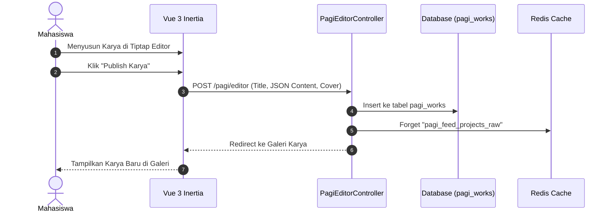
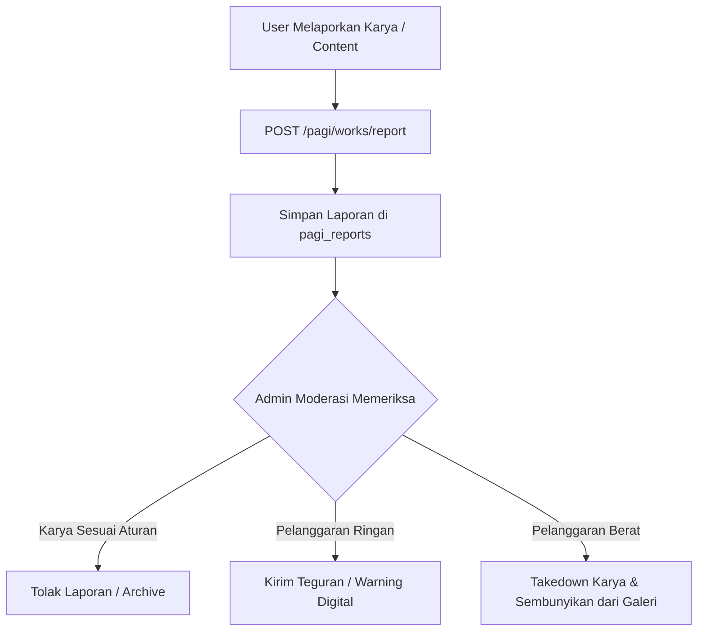

# DOKUMEN TEKNIS PENGAJUAN HAK CIPTA (HKI)
## MODUL PORTOFOLIO & GALERI KARYA DIGITAL "PAGI"
**FMIKOM PORTAL - FAKULTAS ILMU KOMPUTER**

---

## DAFTAR ISI
1. [Identitas Ciptaan](#1-identitas-ciptaan)
2. [Arsitektur Sistem](#2-arsitektur-sistem)
3. [Teknologi yang Digunakan](#3-teknologi-yang-digunakan)
4. [Diagram Modul](#4-diagram-modul)
5. [Struktur Folder Modul](#5-struktur-folder-modul)
6. [Daftar Fitur Utama](#6-daftar-fitur-utama)
7. [Screenshot Setiap Fitur](#7-screenshot-setiap-fitur)
8. [Langkah Penggunaan (User Manual)](#8-langkah-penggunaan-user-manual)
9. [Lampiran Source Code Modul](#9-lampiran-source-code-modul)

---

## 1. IDENTITAS CIPTAAN
* **Judul Ciptaan**: Modul Digital Showcase & Galeri Portofolio Karya "PAGI"
* **Jenis Ciptaan**: Program Komputer / Modul Perangkat Lunak Web
* **Institusi / Pemilik**: Fakultas Ilmu Komputer (FMIKOM)
* **Deskripsi Ringkas**: 
  Modul **PAGI Showcase & Gallery** merupakan subsistem utama pada FMIKOM Portal yang dirancang khusus untuk dokumentasi, publikasi, serta ekspose karya digital dan portofolio akademik mahasiswa. Modul ini dilengkapi dengan editor berbasis *block* (Tiptap Editor), kolaborasi multi-penulis, galeri interaktif dengan fitur umpan balik (suka, komentar, dan balasan), serta sistem kurasi dan moderasi karya otomatis oleh pengelola fakultas.

---

## 2. ARSITEKTUR SISTEM

Modul PAGI Portofolio & Galeri dibangun mengintegrasikan **Vue 3 SPA dengan Laravel MVC Backend** melalui lapisan antarmuka **Inertia.js**, mengoptimalkan performa pemuatan feed karya serta interaksi editor tanpa *page refresh*.

```
+-----------------------------------------------------------------------+
|                            USER BROWSER                               |
|   Vue 3 (Composition API) + Tailwind CSS + Inertia.js Router          |
|   + Tiptap Rich-Text Block Editor + Optimistic Like/Comment UI        |
+-----------------------------------+-----------------------------------+
                                    |
                         HTTPS/JSON | (Inertia Protocol)
                                    v
+-----------------------------------------------------------------------+
|                           LARAVEL BACKEND                             |
|  - Routing Guard: auth, module.context:pagi, throttle                 |
|  - Controllers: PagiDashboardController, PagiEditorController         |
|  - Moderation Controller: AdminModerationController                   |
|  - Cache Invalidation & Tagging (pagi_feed_projects_raw)              |
+-----------------------------------+-----------------------------------+
                                    |
                                    v
+-----------------------------------------------------------------------+
|                    PERSISTENCE & INFRASTRUCTURE                       |
|  - Database: MySQL / PostgreSQL (Tabel: pagi_works, pagi_work_likes)  |
|  - Search Engine: Laravel Scout (Full-Text Search Judul & Tag)        |
|  - Cache Manager: Redis (Cache Feed, Views Counter, & Throttle)       |
|  - Media Storage: Public Cloud / Storage disk (Cover & Content Media) |
+-----------------------------------------------------------------------+
```

### Prinsip Arsitektur Utama:
1. **Block-Based Content Modeling**: Konten portofolio disimpan dalam bentuk struktur data JSON terstandardisasi (*JSON Content Blocks*), memungkinkan rendering visual yang fleksibel dan aman dari serangan XSS.
2. **Lazy-Loaded Payload & Cache Strategy**: Daftar galeri menggunakan pemuatan cepat berbasis *Inertia Deferred Prop*, di mana konten berat dan komentar karya di-load secara *lazy-loading* ketika modal karya dibuka.
3. **Automated Cache Invalidation**: Setiap kali mahasiswa memublikasikan, memperbarui, atau menghapus karya, sistem secara otomatis membersihkan memori *cache Redis* publik untuk memastikan transparansi data karya terbaru.

---

## 3. TEKNOLOGI YANG DIGUNAGAN

### Backend Stack
* **Bahasa Pemrograman**: PHP 8.2+
* **Framework Backend**: Laravel 11.x
* **Search Engine**: Laravel Scout (Pencarian cepat judul, kategori, dan alat yang digunakan)
* **Authentication Guard**: Laravel Auth Session & Spatie Role-Based Access Control

### Frontend Stack
* **Framework Client**: Vue 3 (Script Setup Syntax, Composition API, TypeScript)
* **Single-Page Routing**: Inertia.js v1.x
* **Styling Framework**: Tailwind CSS v3.4+ & Shadcn UI (Radix Vue)
* **Block Editor**: Tiptap Editor v2 (Pengolah kata interaktif dengan custom image/video block)
* **Icon Set**: Lucide Vue Next

### Database & Storage
* **Database**: PostgreSQL / MySQL 8.0+
* **Cache & Rate Limiter**: Redis
* **File Storage**: Laravel Storage System (Storage media gambar & karya)

---

## 4. DIAGRAM MODUL

### A. Diagram Publikasi & Eksplorasi Karya


### B. Diagram Moderasi Konten Laporan Karya


---

## 5. STRUKTUR FOLDER MODUL

```
fmikom-portal/
├── app/
│   ├── Models/
│   │   └── Pagi/
│   │       ├── PagiWork.php           # Model Utama Karya & Portofolio
│   │       ├── PagiWorkComment.php    # Model Komentar Karya
│   │       ├── PagiWorkLike.php       # Model Suka / Like Karya
│   │       ├── PagiReport.php         # Model Laporan karya
│   │       └── PagiWarning.php        # Model Teguran Moderasi
│   └── Modules/
│       └── Pagi/
│           └── Controllers/
│               ├── PagiDashboardController.php  # Galeri & Feed Karya
│               ├── PagiEditorController.php     # Editor Portofolio
│               ├── AdminDashboardController.php # Statistik Portofolio Admin
│               └── AdminModerationController.php# Moderasi & Takedown Karya
├── resources/
│   └── js/
│       └── pages/
│           └── Modules/
│               └── Pagi/
│                   ├── Admin/
│                   │   ├── Reports/Index.vue    # Moderasi Laporan Karya
│                   │   └── Dashboard.vue        # Analytics Portofolio
│                   └── User/
│                       ├── Editor/
│                       │   ├── PagiTiptapEditor.vue  # Block Editor Karya
│                       │   └── EditorPublishModal.vue # Modal Publikasi
│                       ├── Gallery.vue          # Galeri Karya Utama
│                       └── MahasiswaDashboard.vue # Dashboard Feed Mahasiswa
└── routes/
    └── pagi.php                                 # Definisi Rute Portofolio
```

---

## 6. DAFTAR FITUR UTAMA

### 1. **Penyusun Karya Portofolio (Block Editor Tiptap)**
* **Visual Block Editor**: Penyusunan dokumen karya interaktif berbasis *drag/style block* teks, media gambar, dan video.
* **Kolaborasi Penulis**: Kemampuan mengaitkan rekan mahasiswa sebagai anggota/kolaborator pembuatan karya.
* **Pengaturan Visibilitas**: Opsi pemublikasian karya menjadi status *Public* (Galeri Utama), *Draft* (Simpanan Pribadi), atau *Showcase*.

### 2. **Galeri & Feed Karya Interaktif (Gallery Showcase)**
* **Pencarian Instan & Filter Kategori**: Filter karya berdasarkan kategori ilmu, tools yang digunakan, serta pencarian judul berbasis *Full-Text Search*.
* **Interaksi Sosial (Like & Comment)**: Fitur apresiasi karya (*Like*) serta ruang diskusi interaktif dengan dukungan *nested replies* hingga 3 kedalaman.
* **View Counter & Dynamic Preview Modal**: Peninjauan cepat karya melalui jendela *modal* tanpa berpindah halaman, dilengkapi penghitung otomatis total tayangan karya.

### 3. **Profil Portofolio Digital Mahasiswa**
* **Koleksi Karya Mahasiswa**: Tampilan halaman profil khusus yang merangkum seluruh portofolio yang pernah dipublikasikan.
* **Reorder Projects**: Kemampuan mahasiswa untuk mengatur tata letak urutan karya unggulan pada profil pribadi.

### 4. **Pusat Moderasi & Kurasi Karya (Admin Moderation)**
* **Moderasi Laporan Karya**: Sistem penanganan laporan masyarakat/civitas terhadap indikasi pelanggaran hak cipta atau konten tidak pantas.
* **Teguran Digital (Warning) & Takedown**: Fitur tindakan administratif oleh pengelola fakultas untuk menonaktifkan visibilitas karya serta mengirimkan notifikasi teguran resmi.

---

## 7. SCREENSHOT SETIAP FITUR

> **Petunjuk Lampiran Pengajuan HKI**:
> Tempelkan tangkapan layar (*screenshot*) antarmuka aplikasi pada setiap bingkai di bawah ini sebelum dokumen dicetak.

### 7.1 Galeri Utama Karya Mahasiswa (`Gallery.vue`)

*Gambar 7.1: Antarmuka Galeri Utama PAGI yang menampilkan daftar feed karya portofolio digital mahasiswa lengkap dengan filter kategori dan pencarian instan.*

### 7.2 Block Editor Portofolio Tiptap (`PagiTiptapEditor.vue`)

*Gambar 7.2: Antarmuka pembuatan karya berbasis block editor Tiptap dengan fitur penambahan media dan pengaturan kolaborator.*

### 7.3 Modal Pratinjau & Diskusi Karya (`MahasiswaDashboard.vue`)

*Gambar 7.3: Jendela pratinjau detail karya yang menampilkan konten lengkap portofolio, statistik suka, serta kolom komentar interaktif.*

### 7.4 Halaman Profil Portofolio Mahasiswa (`Profile/Index.vue`)

*Gambar 7.4: Halaman profil publik mahasiswa yang menyajikan ringkasan karya portofolio digital serta urutan karya unggulan.*

### 7.5 Moderasi & Kurasi Karya Admin (`Reports/Index.vue`)

*Gambar 7.5: Dashboard administrasi untuk verifikasi laporan karya, tindakan teguran (warning), dan penangguhan publikasi karya (takedown).*

---

## 8. LANGKAH PENGGUNAAN (USER MANUAL)

### A. Alur Mahasiswa (Penulis Portofolio)
1. **Mengakses Modul PAGI**:
   - Masuk ke portal FMIKOM, lalu pilih menu **PAGI Galeri Portofolio**.
2. **Membuat dan Memublikasikan Karya**:
   - Klik tombol **"Buat Karya"** untuk membuka editor portofolio.
   - Isi judul, buat konten menggunakan Tiptap Block Editor, dan unggah gambar sampul (*cover*).
   - Tentukan kategori karya serta tag alat (*tools*) yang digunakan.
   - Klik tombol **"Publish"** untuk menayangkan karya ke Galeri Fakultas.
3. **Berinteraksi di Galeri Karya**:
   - Buka menu **Galeri**.
   - Pilih karya mahasiswa lain untuk melihat detail portofolio.
   - Berikan apresiasi tombol **Suka (Like)** atau tuliskan tanggapan pada kolom **Komentar**.

### B. Alur Pengelola (Admin Moderasi)
1. **Membuka Dashboard Moderasi Karya**:
   - Login dengan hak akses Admin Fakultas (`admin-universitas` / `prodi`).
   - Akses menu **Admin Moderasi -> Laporan Karya**.
2. **Melakukan Tindakan Moderasi**:
   - Tinjau daftar karya yang dilaporkan oleh pengguna.
   - Pilih tombol **"Takedown Karya"** jika konten terbukti melanggar etika/hak cipta agar karya disembunyikan dari galeri publik.

---

## 9. LAMPIRAN SOURCE CODE MODUL

Berikut adalah potongan kode sumber utama (*Core Code*) yang mengatur data dan logika bisnis pembuatan serta pengelolaan portofolio:

### 9.1 Model Utama Karya Portofolio (`app/Models/Pagi/PagiWork.php`)
```php
<?php

namespace App\Models\Pagi;

use App\Models\User;
use Illuminate\Database\Eloquent\Model;
use Illuminate\Support\Facades\Cache;
use Laravel\Scout\Searchable;

class PagiWork extends Model
{
    use Searchable;

    protected $table = 'pagi_works';

    protected $fillable = [
        'user_id',
        'title',
        'content',
        'cover_image',
        'is_published',
        'visibility',
        'status',
        'views_count',
        'description',
        'category',
        'tools_used',
    ];

    protected $casts = [
        'content' => 'array',
        'is_published' => 'boolean',
    ];

    public function toSearchableArray(): array
    {
        return [
            'id' => $this->id,
            'title' => $this->title,
            'description' => $this->description ?? '',
            'category' => $this->category ?? '',
            'tools_used' => $this->tools_used ?? '',
            'user_id' => $this->user_id,
            'views_count' => $this->views_count ?? 0,
            'status' => $this->status ?? '',
        ];
    }

    protected static function booted(): void
    {
        static::saved(function ($work) {
            Cache::forget('pagi_feed_projects_raw');
            Cache::forget('pagi_admin_stats');
        });

        static::deleted(function ($work) {
            Cache::forget('pagi_feed_projects_raw');
            Cache::forget('pagi_admin_stats');
        });
    }
}
```

### 9.2 Controller Pembuatan Karya (`app/Modules/Pagi/Controllers/PagiEditorController.php`)
```php
<?php

namespace App\Modules\Pagi\Controllers;

use App\Http\Controllers\Controller;
use App\Models\Pagi\PagiWork;
use Illuminate\Http\RedirectResponse;
use Illuminate\Http\Request;
use Inertia\Inertia;
use Inertia\Response;

class PagiEditorController extends Controller
{
    public function editor(): Response
    {
        return Inertia::render('Modules/Pagi/User/Editor/PagiTiptapEditor');
    }

    public function store(Request $request): RedirectResponse
    {
        $validated = $request->validate([
            'title' => 'required|string|max:255',
            'content' => 'required|array',
            'category' => 'required|string',
            'cover_image' => 'nullable|string',
        ]);

        $work = PagiWork::create([
            'user_id' => auth()->id(),
            'title' => $validated['title'],
            'content' => $validated['content'],
            'category' => $validated['category'],
            'cover_image' => $validated['cover_image'] ?? null,
            'is_published' => true,
            'status' => 'active',
        ]);

        return redirect()->route('module.pagi.gallery')
            ->with('success', 'Karya portofolio berhasil dipublikasikan!');
    }
}
```

---
*Dokumen ini disusun khusus sebagai kelengkapan berkas permohonan Hak Kekayaan Intelektual (HKI) Modul Software Showcase Portofolio Digital PAGI FMIKOM Portal.*
