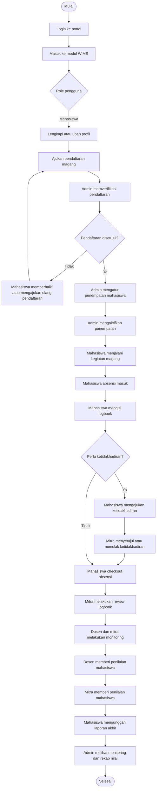
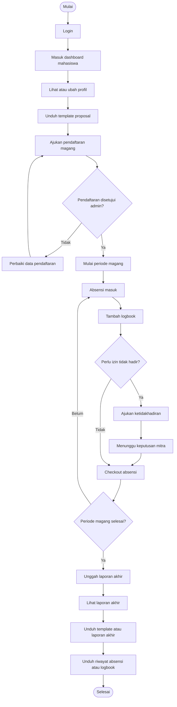
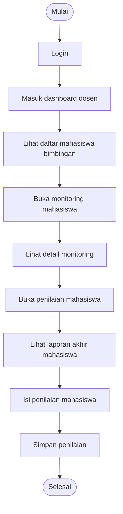
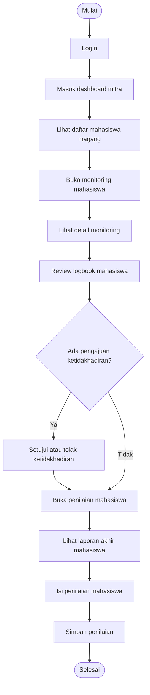
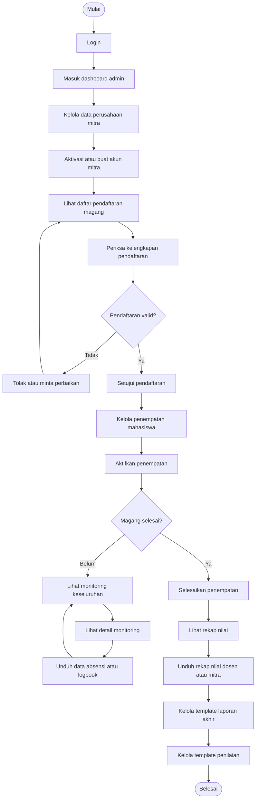
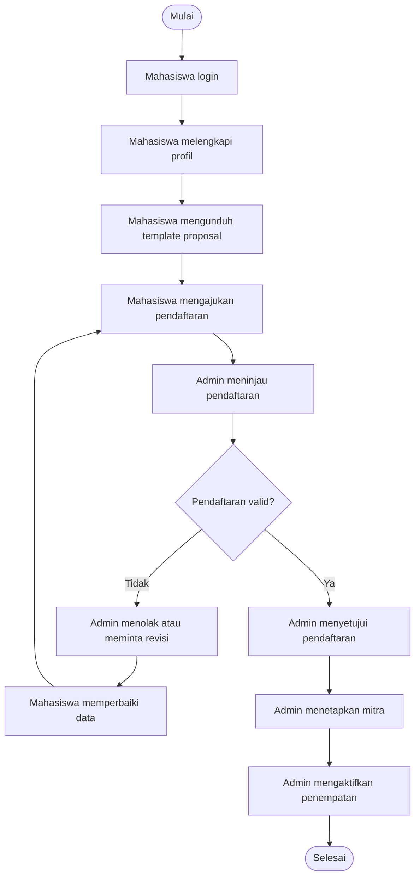
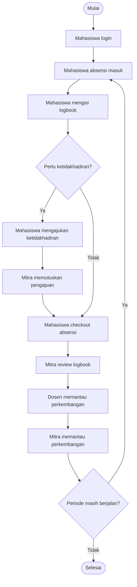
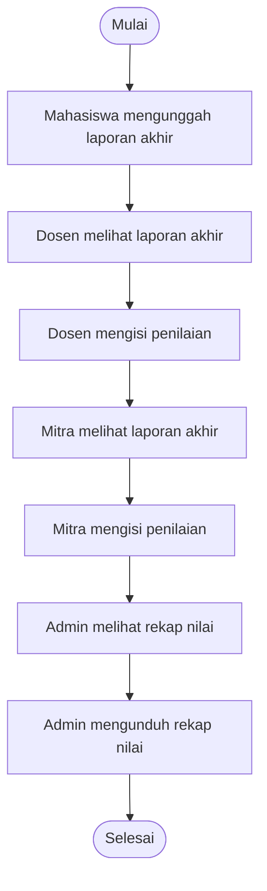

# Activity Diagram WIMS

Dokumen ini berisi activity diagram modul **WIMS (Web-based Internship Management System)** berdasarkan implementasi lokal pada repo saat ini.

## Aktor Utama

- Mahasiswa
- Dosen
- Mitra
- Admin

Catatan:
- Role `Admin` pada implementasi portal mencakup `super-admin`, `admin`, `admin-universitas`, `admin-akademik`, dan `prodi`.
- Diagram berikut disusun dari alur yang tersedia pada `routes/wims.php` dan struktur modul `app/Modules/Wims/`.

## 1. Activity Diagram Keseluruhan

## 2. Activity Diagram Mahasiswa

## 3. Activity Diagram Dosen

## 4. Activity Diagram Mitra

## 5. Activity Diagram Admin

## 6. Activity Diagram Proses Pendaftaran Dan Penempatan

## 7. Activity Diagram Proses Operasional Harian Magang

## 8. Activity Diagram Proses Penilaian Dan Laporan Akhir

## 9. Narasi Singkat Untuk Skripsi

Narasi yang dapat digunakan:

> Activity diagram modul WIMS menggambarkan alur aktivitas utama pada sistem pengelolaan magang berbasis web. Proses dimulai dari mahasiswa yang melakukan pendaftaran magang, dilanjutkan dengan verifikasi oleh admin, penempatan ke mitra, pelaksanaan kegiatan harian seperti absensi dan logbook, monitoring oleh dosen dan mitra, penilaian, hingga pengunggahan laporan akhir dan rekapitulasi hasil. Diagram ini menunjukkan bahwa setiap aktor memiliki peran yang berbeda, tetapi saling terhubung dalam satu proses bisnis magang yang terintegrasi.

## 10. Referensi Implementasi

- `routes/wims.php`
- `app/Modules/Wims/Controllers/`
- `app/Modules/Wims/Services/`
- `docs/wims-product-documentation.md`
- `docs/wims-user-stories-backlog.md`
