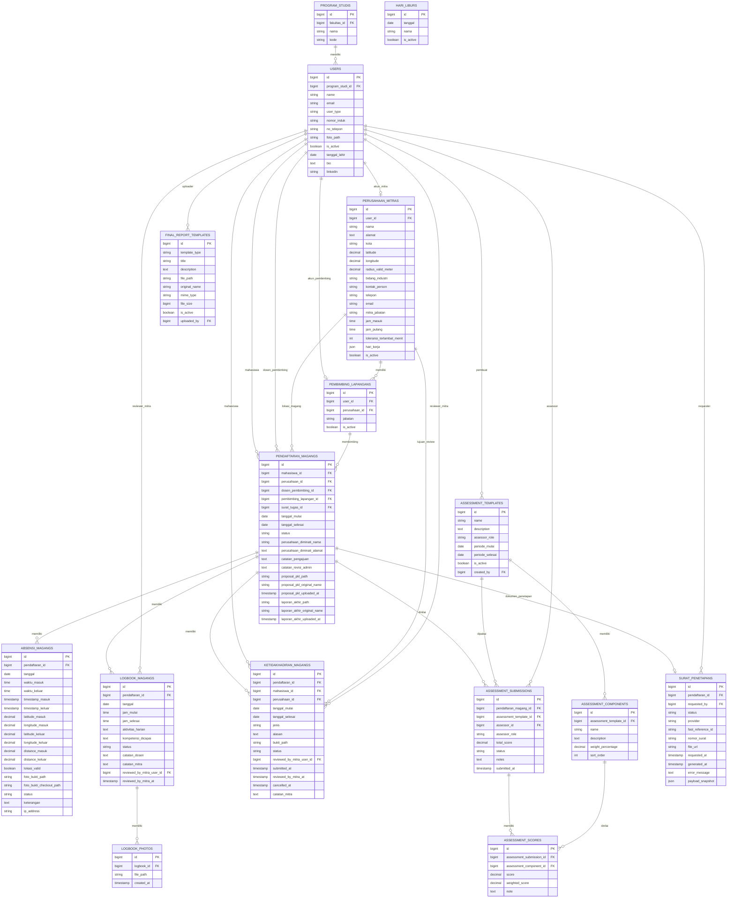
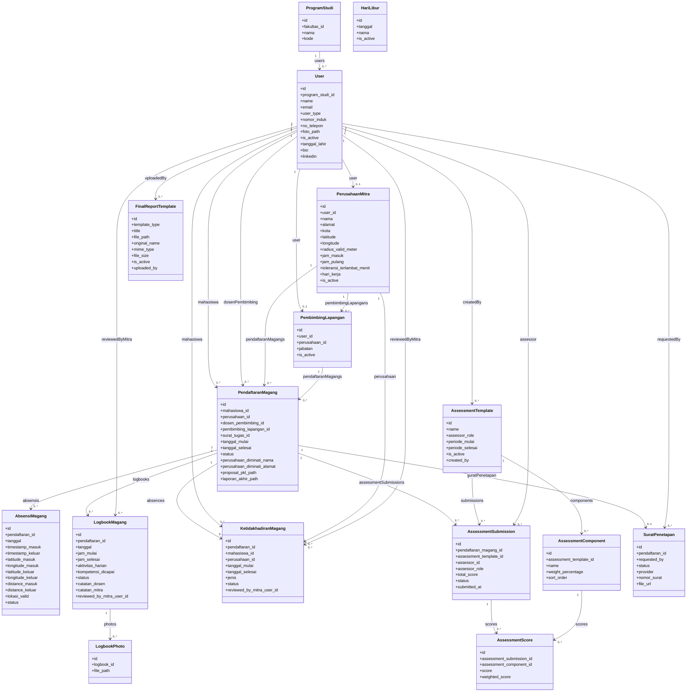

# ERD dan Class Diagram WIMS

Dokumen ini merangkum **ERD** dan **class diagram** modul **WIMS (Web-based Internship Management System)** berdasarkan **migrasi dan model aktif** di repo saat ini.

## Dasar Validasi

Dokumen ini disusun dari:

- `database/migrations/magang/`
- `database/migrations/core/`
- `database/migrations/2026_07_01_000000_create_final_report_templates_table.php`
- `database/migrations/2026_07_04_000000_add_template_type_to_final_report_templates_table.php`
- `app/Models/Magang/`
- `app/Modules/Wims/Services/`
- `routes/wims.php`

Catatan validasi:

- Saya **tidak menggunakan tabel legacy/fallback** bila fitur aktif WIMS sudah memakai tabel baru.
- Saya **tidak memasukkan kolom `users.nim_nip`** karena kolom itu sudah dihapus oleh migrasi aktif; field identitas aktif yang dipakai database adalah `users.nomor_induk`.
- Saya **tidak menjadikan `penilaian_magangs` sebagai tabel utama ERD WIMS**, karena implementasi WIMS aktif memakai `assessment_templates`, `assessment_components`, `assessment_submissions`, dan `assessment_scores`.
- Saya **tidak menarik tabel `surats` ke diagram inti**, walaupun `pendaftaran_magangs` masih memiliki `surat_tugas_id`, karena relasi itu belum menjadi alur aktif utama di service/controller WIMS saat ini.
- Tabel `final_report_templates` memakai skema aktif yang mencakup kolom `template_type`. Ada file migrasi `.disabled` di folder `magang`, tetapi itu bukan sumber skema aktif.

## 1. Tabel Aktif Yang Dipakai WIMS

Tabel inti yang aktif dipakai modul:

- `users`
- `program_studis`
- `perusahaan_mitras`
- `pembimbing_lapangans`
- `pendaftaran_magangs`
- `absensi_magangs`
- `logbook_magangs`
- `logbook_photos`
- `ketidakhadiran_magangs`
- `hari_liburs`
- `assessment_templates`
- `assessment_components`
- `assessment_submissions`
- `assessment_scores`
- `final_report_templates`
- `surat_penetapans`

## 2. ERD WIMS

## 3. Class Diagram WIMS

## 4. Penjelasan Entitas Utama

### `users`

Tabel ini menjadi sumber aktor WIMS:

- mahasiswa
- dosen
- mitra
- admin

Kolom aktif yang paling relevan untuk WIMS:

- `id`
- `program_studi_id`
- `name`
- `email`
- `user_type`
- `nomor_induk`
- `no_telepon`
- `foto_path`
- `is_active`
- `tanggal_lahir`
- `bio`
- `linkedin`

Catatan:

- `nomor_induk` adalah kolom identitas aktif.
- `nim_nip` masih muncul di beberapa fallback kode, tetapi **kolom database-nya sudah di-drop**, jadi tidak dimasukkan ke ERD utama.

### `perusahaan_mitras`

Mewakili perusahaan/instansi mitra tempat mahasiswa magang. Tabel ini juga menyimpan konfigurasi operasional presensi, misalnya:

- koordinat kantor
- radius validasi lokasi
- jam kerja
- toleransi keterlambatan
- hari kerja
- akun user mitra aktif

### `pendaftaran_magangs`

Ini adalah tabel sentral WIMS. Hampir semua proses terhubung ke sini:

- pendaftaran mahasiswa
- penempatan ke mitra
- dosen pembimbing
- pembimbing lapangan
- proposal PKL
- laporan akhir
- absensi
- logbook
- penilaian

### `absensi_magangs`

Menyimpan presensi harian mahasiswa:

- tanggal
- check-in/check-out
- koordinat GPS
- validasi radius
- foto bukti
- status absensi

### `logbook_magangs` dan `logbook_photos`

`logbook_magangs` menyimpan aktivitas harian mahasiswa, sedangkan `logbook_photos` menyimpan lampiran foto aktivitas logbook.

### `ketidakhadiran_magangs`

Menyimpan pengajuan izin/sakit/tidak hadir dari mahasiswa, termasuk:

- rentang tanggal
- alasan
- bukti lampiran
- status review
- reviewer dari pihak mitra

### `assessment_templates`, `assessment_components`, `assessment_submissions`, `assessment_scores`

Ini adalah struktur penilaian aktif WIMS.

Alurnya:

- admin membuat `assessment_templates`
- tiap template memiliki beberapa `assessment_components`
- dosen/mitra mengirim `assessment_submissions`
- setiap submission memiliki detail nilai di `assessment_scores`

Inilah skema penilaian aktif yang dipakai controller/service WIMS, bukan `penilaian_magangs`.

### `final_report_templates`

Menyimpan template dokumen untuk:

- `proposal`
- `final_report`

Kolom `template_type` adalah kolom aktif yang membedakan jenis template.

### `surat_penetapans`

Menyimpan dokumen penetapan penempatan mahasiswa yang dihasilkan dari workflow administratif.

### `hari_liburs`

Dipakai untuk sinkronisasi kehadiran dan monitoring, agar hari libur tidak dianggap alfa atau hari kerja aktif.

## 5. Tabel/Kolom Yang Sengaja Tidak Dijadikan Dasar Diagram Utama

### Tidak dimasukkan sebagai tabel utama

- `penilaian_magangs`
  Alasan: skema penilaian aktif WIMS sudah memakai tabel assessment baru.

- `surats`
  Alasan: ada FK `surat_tugas_id`, tetapi belum menjadi relasi aktif utama dalam alur WIMS saat ini.

### Tidak dimasukkan sebagai kolom aktif

- `users.nim_nip`
  Alasan: sudah dihapus oleh migrasi aktif, walaupun masih ada fallback referensi di sebagian kode.

## 6. Narasi Singkat Untuk Skripsi

Narasi yang bisa dipakai:

> ERD modul WIMS menunjukkan bahwa tabel pusat sistem adalah `pendaftaran_magangs` karena menjadi penghubung antara data mahasiswa, perusahaan mitra, dosen pembimbing, pembimbing lapangan, absensi, logbook, ketidakhadiran, penilaian, laporan akhir, dan dokumen penetapan. Struktur penilaian pada implementasi aktif WIMS tidak lagi bergantung pada tabel penilaian lama, melainkan menggunakan pendekatan template, komponen, submission, dan skor penilaian. Sementara itu, class diagram menggambarkan relasi antar model utama yang dipakai oleh service dan controller modul WIMS dalam mengelola seluruh siklus magang.

## 7. Referensi Implementasi

- `routes/wims.php`
- `app/Models/Magang/`
- `app/Modules/Wims/Services/`
- `database/migrations/magang/`
- `database/migrations/core/`
- `database/migrations/2026_07_01_000000_create_final_report_templates_table.php`
- `database/migrations/2026_07_04_000000_add_template_type_to_final_report_templates_table.php`
