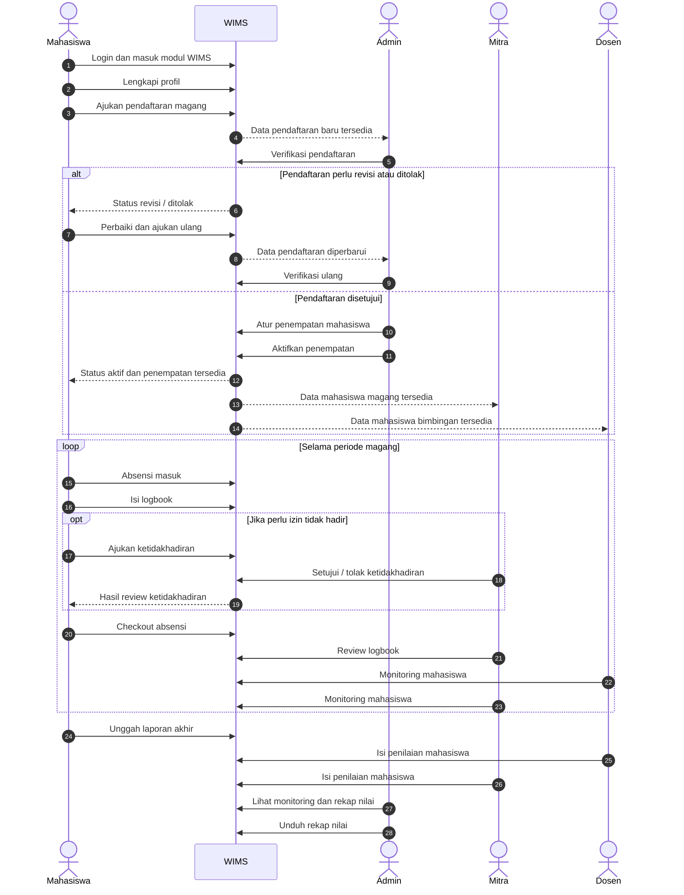
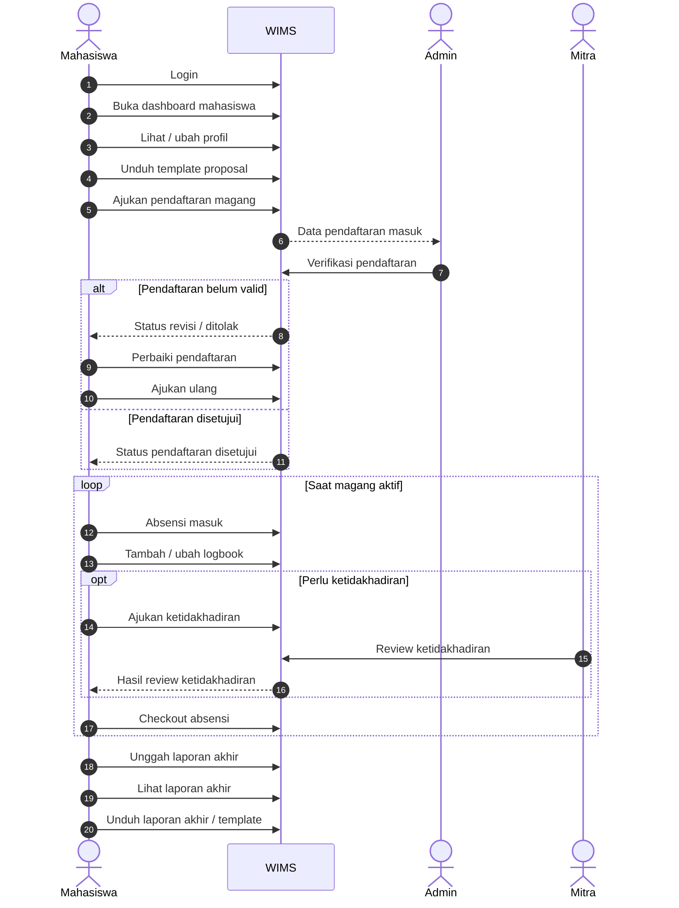
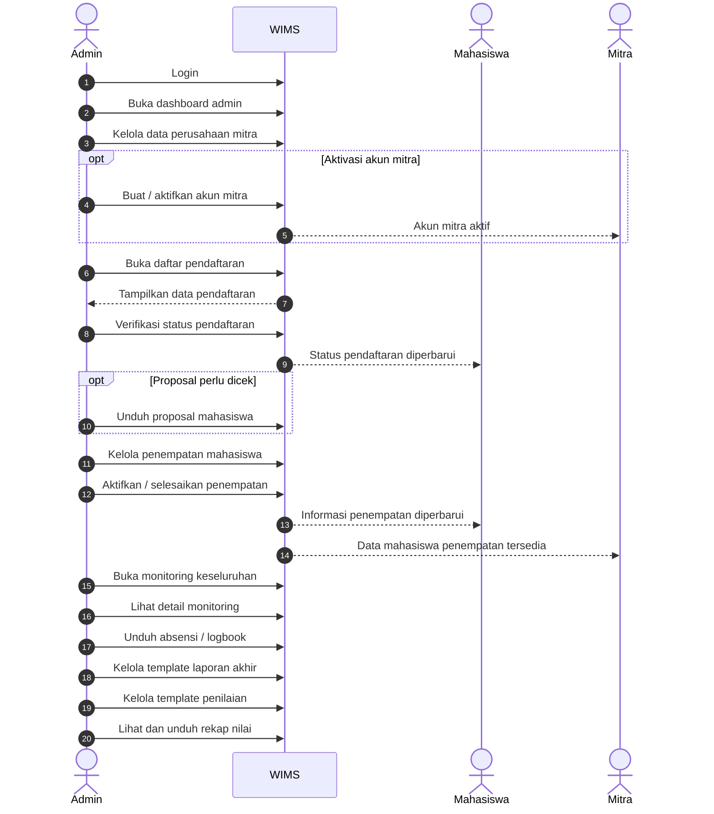
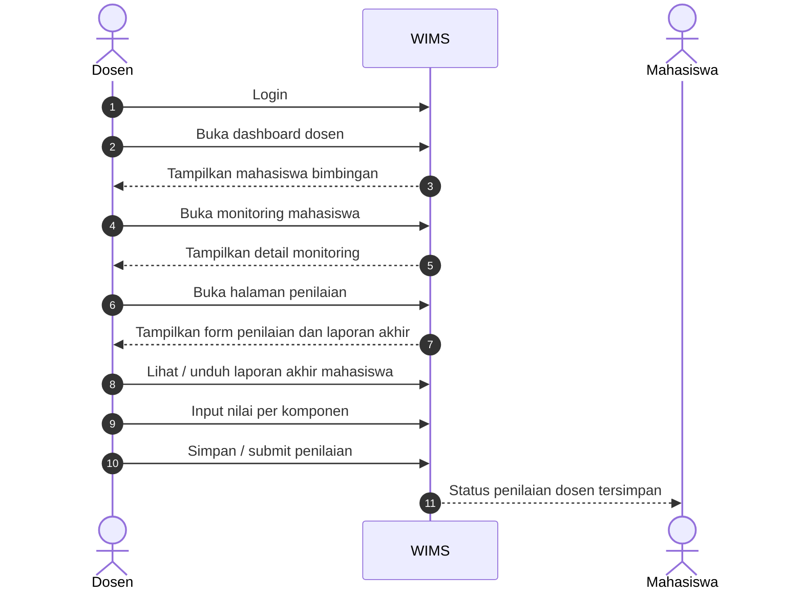
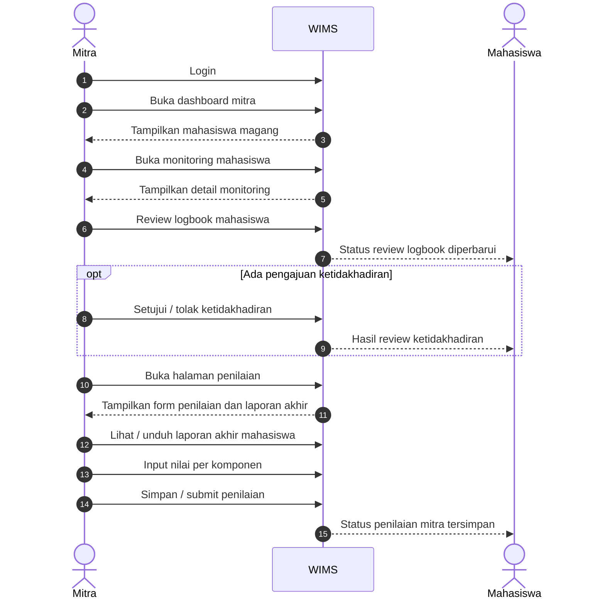
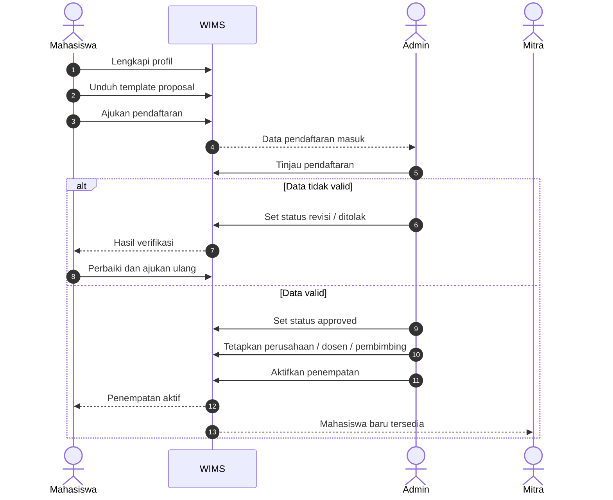
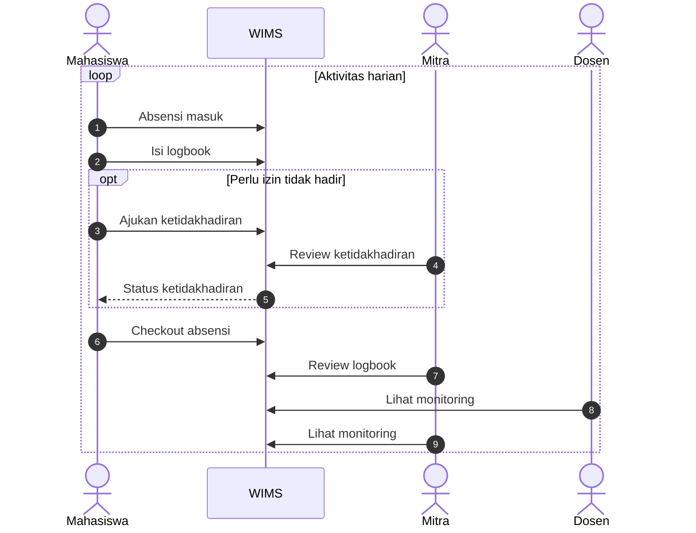
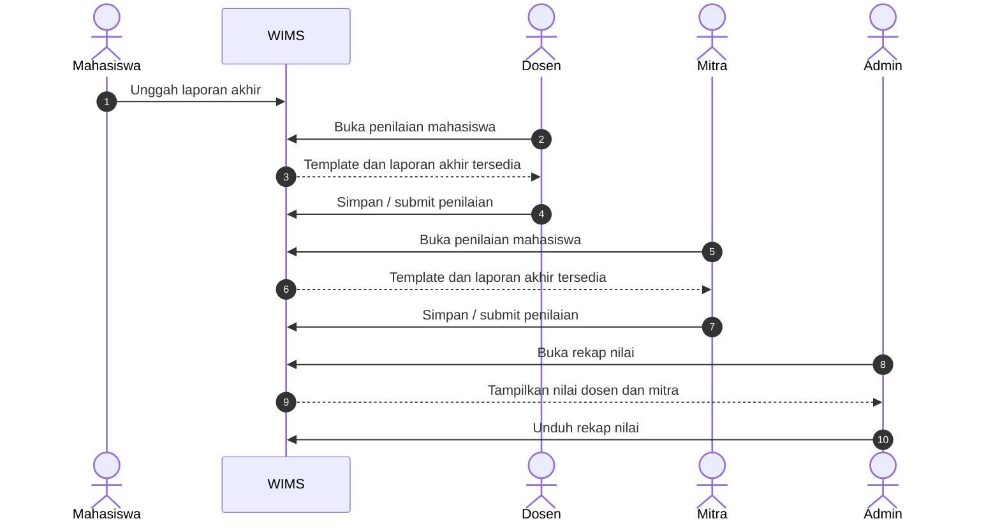

# Sequence Diagram WIMS

Dokumen ini berisi **sequence diagram** modul **WIMS (Web-based Internship Management System)** berdasarkan alur aktif pada repo saat ini.

## Dasar Penyusunan

Dokumen ini disusun dari:

- `routes/wims.php`
- `app/Modules/Wims/Controllers/`
- `app/Modules/Wims/Services/`
- `app/Models/Magang/`

Catatan:

- Diagram difokuskan pada **interaksi antar aktor dan sistem WIMS**.
- Diagram memakai aktor utama:
  - `Mahasiswa`
  - `Admin`
  - `Dosen`
  - `Mitra`
  - `WIMS`
- Alur penilaian memakai skema aktif `assessment_templates`, `assessment_submissions`, dan `assessment_scores`, bukan tabel penilaian legacy.

## 1. Sequence Diagram Keseluruhan

## 2. Sequence Diagram Mahasiswa

## 3. Sequence Diagram Admin

## 4. Sequence Diagram Dosen

## 5. Sequence Diagram Mitra

## 6. Sequence Diagram Pendaftaran Dan Penempatan

## 7. Sequence Diagram Operasional Harian Magang

## 8. Sequence Diagram Penilaian Dan Laporan Akhir

## 9. Penjelasan Singkat Sequence Diagram

Sequence diagram WIMS menjelaskan **urutan komunikasi** antara aktor dan sistem.

Makna tiap diagram:

- **Diagram keseluruhan** menunjukkan alur end-to-end dari pendaftaran hingga penilaian akhir.
- **Diagram mahasiswa** menekankan interaksi mahasiswa sejak pendaftaran, kegiatan harian, hingga laporan akhir.
- **Diagram admin** menekankan fungsi administratif seperti verifikasi, penempatan, monitoring, dan pengelolaan template.
- **Diagram dosen** menunjukkan monitoring dan penilaian akademik mahasiswa.
- **Diagram mitra** menunjukkan monitoring lapangan, review logbook, review ketidakhadiran, dan penilaian lapangan.
- **Diagram pendaftaran dan penempatan** memfokuskan alur awal sebelum magang aktif.
- **Diagram operasional harian** memfokuskan absensi, logbook, ketidakhadiran, dan monitoring.
- **Diagram penilaian dan laporan akhir** memfokuskan unggah laporan, penilaian dosen/mitra, dan rekap nilai admin.

## 10. Narasi Singkat Untuk Skripsi

Narasi yang dapat digunakan:

> Sequence diagram modul WIMS menggambarkan urutan interaksi antara mahasiswa, admin, dosen, mitra, dan sistem dalam setiap proses utama. Diagram ini menunjukkan bahwa mahasiswa memulai proses melalui pendaftaran, kemudian admin melakukan verifikasi dan penempatan, setelah itu mahasiswa menjalankan aktivitas harian magang yang dimonitor oleh dosen dan mitra. Pada tahap akhir, mahasiswa mengunggah laporan akhir, dosen dan mitra memberikan penilaian, dan admin melakukan rekapitulasi hasil. Dengan demikian, sequence diagram memperjelas aliran pesan dan tanggung jawab setiap aktor dalam modul WIMS.

## 11. Referensi Implementasi

- `routes/wims.php`
- `app/Modules/Wims/Controllers/`
- `app/Modules/Wims/Services/`
- `app/Models/Magang/`
