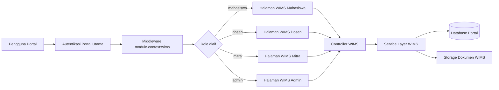

# Data Mentah Pengisian Template Dokumentasi Modul WIMS

Dokumen ini disusun dari state repo lokal per 2026-07-26 dan dipetakan langsung ke struktur pada file `Template Dokumentasi Modul.docx`.

Ruang lingkup:
- hanya untuk modul `WIMS`
- tidak mencampur modul `FAST`, `PAGI`, atau `TRACE`
- fokus pada data mentah, narasi awal, dan data pendukung yang bisa diolah ulang

Sumber utama:
- `routes/wims.php`
- `app/Modules/Wims/`
- `app/Models/Magang/`
- `database/migrations/magang/`
- `database/seeders/ModuleSeeder.php`
- `tests/Feature/Wims/`
- `docs/wims-product-documentation.md`
- `docs/wims-product-documentation-stakeholder.md`
- `docs/wims-use-case-diagram.md`
- `docs/wims-activity-diagram.md`
- `docs/wims-sequence-diagram.md`
- `docs/wims-erd-class-diagram.md`
- `panduan.txt`

Catatan penting:
- template Word hanya memberi struktur besar, bukan isi final
- ada beberapa metadata administratif yang tidak bisa dipastikan hanya dari codebase
- item yang belum terkonfirmasi diberi label `PERLU KONFIRMASI`

## 1. Pemetaan Isi Template

### 1.1 Halaman Sampul

Data mentah yang bisa dipakai:
- Judul ciptaan:
  - `Modul WIMS - Work & Internship Management System`
  - alternatif formal sesuai seeder modul: `Modul WIMS - Web-based Internship Management System`
- Logo UNUGHA:
  - `PERLU KONFIRMASI`
  - tidak ditemukan asset logo resmi pada repo yang bisa dianggap sumber otoritatif
- Logo karya/ciptaan:
  - `PERLU KONFIRMASI`
  - tidak ada logo khusus WIMS yang terkonfirmasi di repo
  - alternatif praktis: gunakan wordmark WIMS atau screenshot dashboard sebagai identitas visual
- Fakultas:
  - `FMIKOM`
  - bentuk panjang resmi fakultas `PERLU KONFIRMASI`
- Program Studi:
  - `PERLU KONFIRMASI`
  - codebase hanya menunjukkan bahwa pengguna terkait `program_studis`, tetapi tidak menetapkan satu prodi tunggal untuk WIMS
- Tahun:
  - `2026` jika dokumen ingin mengikuti state implementasi repo saat ini

Narasi cover yang bisa dipakai:

`WIMS merupakan modul pengelolaan PKL dan magang yang terintegrasi di dalam portal utama FMIKOM. Modul ini mendukung alur pendaftaran, penempatan, presensi, logbook, monitoring, penilaian, dan laporan akhir dalam satu sistem berbasis web.`

### 1.2 Deskripsi Umum

Narasi mentah:

`WIMS adalah Web-based Internship Management System yang dikembangkan sebagai modul di dalam portal utama FMIKOM. Sistem ini berfungsi untuk memusatkan proses administrasi dan operasional magang, mulai dari pengajuan pendaftaran mahasiswa, verifikasi oleh admin, penempatan ke perusahaan mitra, pencatatan presensi dan logbook, monitoring oleh dosen serta mitra, sampai penilaian dan pengelolaan laporan akhir. Implementasi WIMS pada repo saat ini menggunakan pendekatan modular monolith sehingga autentikasi, data pengguna, dan konteks peran mengikuti portal utama tanpa perlu aplikasi terpisah.`

Fakta mentah pendukung:
- kode modul: `WIMS`
- nama modul di seeder: `Web-based Internship Management System`
- deskripsi modul di seeder:
  - `Pengelolaan PKL dan magang FMIKOM: pendaftaran, penempatan, presensi, logbook, monitoring, penilaian, dan laporan akhir`
- modul aktif di portal, bukan aplikasi berdiri sendiri
- role aktif WIMS:
  - `super-admin`
  - `admin`
  - `admin-universitas`
  - `admin-akademik`
  - `prodi`
  - `dosen`
  - `mahasiswa`
  - `mitra`

### 1.3 Latar Belakang

Butir latar belakang mentah:
- pengelolaan magang melibatkan banyak aktor: mahasiswa, dosen, mitra, dan admin
- proses inti magang tidak hanya administratif, tetapi juga operasional harian
- data magang perlu tersentralisasi agar status pendaftaran, penempatan, presensi, logbook, penilaian, dan laporan akhir tidak tersebar
- integrasi dengan portal utama mengurangi duplikasi autentikasi dan pengelolaan akun
- modul ini mendukung monitoring yang lebih jelas karena seluruh aktivitas magang tercatat dalam satu alur sistem
- dokumen backlog WIMS menempatkan fitur akses role, pendaftaran, penempatan, presensi, logbook, monitoring, laporan akhir, dan penilaian sebagai prioritas inti

Narasi mentah siap olah:

`Latar belakang pengembangan WIMS berangkat dari kebutuhan untuk mengelola proses PKL dan magang secara terpusat, terdokumentasi, dan mudah dipantau oleh seluruh pihak yang terlibat. Sebelum ada sistem terintegrasi, proses magang berpotensi tersebar pada berbagai dokumen, komunikasi manual, dan pencatatan terpisah antara pihak kampus dan mitra. Kondisi tersebut menyulitkan verifikasi pendaftaran, penetapan penempatan, pemantauan kehadiran, evaluasi aktivitas harian, hingga rekap hasil akhir. Oleh karena itu, WIMS dikembangkan sebagai modul berbasis web yang terintegrasi dengan portal utama FMIKOM agar seluruh data dan aktivitas magang dapat dikelola dalam satu ekosistem sistem informasi.`

### 1.4 Tujuan

Butir tujuan mentah:
- menyederhanakan proses administrasi magang
- menyediakan satu sumber data untuk seluruh aktivitas magang
- meningkatkan visibilitas proses bagi mahasiswa, dosen, mitra, dan admin
- memudahkan evaluasi dan rekap hasil melalui alur yang terdokumentasi
- mengurangi proses manual dalam pengelolaan magang
- menyatukan data operasional dan akademik dalam satu modul

Narasi mentah siap olah:

`Tujuan pengembangan WIMS adalah menyediakan sistem pengelolaan magang berbasis web yang mampu menyederhanakan proses administrasi dan operasional magang secara terintegrasi. Sistem ini ditujukan untuk menjadi satu sumber data bagi aktivitas pendaftaran, penempatan, presensi, logbook, monitoring, penilaian, dan laporan akhir, sekaligus meningkatkan keterlihatan proses bagi mahasiswa, dosen, mitra, dan admin. Selain itu, WIMS juga bertujuan untuk mempercepat koordinasi antar pihak dan memudahkan evaluasi hasil magang melalui pencatatan yang lebih terstruktur.`

### 1.5 Arsitektur dan Teknologi

#### Penjelasan arsitektur

Arsitektur yang terkonfirmasi dari repo:
- pendekatan: `Modular Monolith`
- platform utama: satu aplikasi Laravel yang menampung beberapa modul
- WIMS berjalan sebagai modul internal portal, bukan aplikasi terpisah
- autentikasi mengikuti portal utama
- akses modul dikontrol middleware `auth`, `EnsureFirstTimeLoginComplete`, dan `module.context:wims`
- role aktif menentukan redirect ke dashboard mahasiswa, dosen, mitra, atau admin
- frontend dirender melalui Inertia dan halaman Vue khusus WIMS

Narasi mentah:

`Secara arsitektural, WIMS dibangun dengan pendekatan modular monolith. Artinya, modul WIMS berjalan di dalam satu aplikasi portal utama yang sama dengan modul lain, berbagi autentikasi, basis data, dan model pengguna. Pendekatan ini memungkinkan single sign-on secara alami karena pengguna yang sudah login ke portal utama dapat langsung mengakses WIMS sesuai role aktifnya. Pada sisi backend, alur bisnis WIMS dipisah ke dalam controller dan service khusus modul. Pada sisi frontend, antarmuka dibangun menggunakan halaman Inertia Vue yang dipisahkan berdasarkan role pengguna.`

Mermaid mentah untuk ilustrasi arsitektur:

Referensi arsitektur:
- `panduan.txt`
- `app/Modules/Wims/Controllers/WimsDashboardController.php`
- `app/Modules/Wims/Services/Shared/Portal/WimsModuleRoleService.php`
- `routes/wims.php`

#### Spesifikasi teknologi

Backend:
- `PHP 8.2`
- `Laravel 12`
- `Inertia Laravel 2`

Frontend:
- `Vue 3.5`
- `TypeScript 5`
- `Vite 7`
- `Tailwind CSS 4`

Library relevan untuk konteks WIMS:
- `leaflet` dan `leaflet.markercluster`
  - relevan untuk fitur lokasi dan monitoring berbasis koordinat
- `apexcharts` dan `chart.js`
  - relevan untuk dashboard dan visualisasi
- `axios`
  - komunikasi frontend-backend
- `laravel-wayfinder`
  - integrasi route helper frontend

Lapisan aplikasi WIMS yang teridentifikasi:
- routing: `routes/wims.php`
- controller: `app/Modules/Wims/Controllers/`
- request validation: `app/Modules/Wims/Requests/`
- service layer: `app/Modules/Wims/Services/`
- support classes: `app/Modules/Wims/Support/`
- page components: `resources/js/pages/Modules/Wims/`
- model data: `app/Models/Magang/`

#### Database

Data dari `.env.example`:
- `DB_CONNECTION=sqlite`
- driver default contoh pengembangan: `sqlite`
- host/port MySQL juga tersedia sebagai konfigurasi umum:
  - `DB_HOST=127.0.0.1`
  - `DB_PORT=3306`

Catatan yang aman dipakai:
- basis data relasional dipakai sebagai pusat data portal dan WIMS
- untuk konteks pengembangan lokal, contoh konfigurasi default repo memakai `sqlite`
- untuk deployment nyata, koneksi relasional dapat diarahkan ke mesin database lain sesuai lingkungan

#### Kebutuhan infrastruktur

Kebutuhan yang terkonfirmasi dari konfigurasi repo:
- web server / app server untuk Laravel
- database relasional untuk data portal dan WIMS
- storage file untuk proposal, laporan akhir, bukti presensi, dan lampiran logbook
- queue driver `database`
- session driver `database`
- cache store `database`
- filesystem default `local`
- broadcast default `log`
- reverb tersedia sebagai opsi real-time, tetapi bukan syarat minimum WIMS

Fakta penyimpanan file WIMS:
- helper `App\Support\WimsStorage` memakai disk utama `local`
- fallback ke disk legacy `public` untuk kompatibilitas file lama
- file WIMS disimpan terkontrol, bukan diasumsikan publik

Narasi infrastruktur mentah:

`Pada lingkungan pengembangan, WIMS berjalan sebagai bagian dari aplikasi Laravel portal utama dengan basis data relasional, session berbasis database, queue berbasis database, dan penyimpanan file lokal. Infrastruktur minimum yang dibutuhkan meliputi server aplikasi PHP/Laravel, database untuk data operasional, serta storage untuk dokumen seperti proposal, laporan akhir, foto bukti presensi, dan lampiran logbook. Karena modul ini menggunakan arsitektur modular monolith, WIMS tidak memerlukan server autentikasi terpisah dan dapat memanfaatkan infrastruktur inti portal yang sama.`

### 1.6 Struktur dan Fitur Utama

#### Struktur modul berdasarkan role

Mahasiswa:
- dashboard mahasiswa
- profil mahasiswa
- pendaftaran magang
- unduh template proposal
- presensi check-in
- presensi check-out
- unduh riwayat presensi
- pengajuan ketidakhadiran
- tambah dan ubah logbook
- unduh logbook periode aktif
- unggah laporan akhir
- lihat dan unduh laporan akhir
- unduh template laporan akhir

Dosen:
- dashboard dosen
- monitoring daftar mahasiswa
- monitoring detail mahasiswa
- penilaian mahasiswa
- lihat laporan akhir mahasiswa
- unduh laporan akhir mahasiswa

Mitra:
- dashboard mitra
- monitoring daftar mahasiswa
- monitoring detail mahasiswa
- review logbook mahasiswa
- setujui ketidakhadiran
- tolak ketidakhadiran
- penilaian mahasiswa
- lihat laporan akhir mahasiswa
- unduh laporan akhir mahasiswa

Admin:
- dashboard admin WIMS
- kelola perusahaan mitra
- buat atau aktivasi akun mitra
- verifikasi pendaftaran
- bulk approve pendaftaran
- kelola penempatan mahasiswa
- aktivasi penempatan
- penyelesaian penempatan individual dan massal
- monitoring keseluruhan
- detail monitoring mahasiswa
- unduh absensi mahasiswa
- unduh logbook mahasiswa
- rekap nilai dosen dan mitra
- kelola template proposal/laporan akhir
- kelola template penilaian

#### Daftar route utama per role

Entry modul:
- `GET /wims`

Mahasiswa:
- `GET /wims/dashboard`
- `GET /wims/profil`
- `POST /wims/profil`
- `GET /wims/pendaftaran`
- `POST /wims/pendaftaran`
- `GET /wims/pendaftaran/template-proposal/download`
- `GET /wims/absensi`
- `POST /wims/absensi`
- `POST /wims/absensi/checkout`
- `GET /wims/absensi/download`
- `POST /wims/ketidakhadiran`
- `DELETE /wims/ketidakhadiran/{ketidakhadiran}`
- `GET /wims/logbook`
- `POST /wims/logbook`
- `PUT /wims/logbook/{logbook}`
- `GET /wims/logbook/download`
- `GET /wims/laporan`
- `POST /wims/laporan`
- `GET /wims/laporan/final-report/view`
- `GET /wims/laporan/template/download`
- `GET /wims/laporan/final-report/download`

Admin:
- `GET /wims/admin/dashboard`
- `GET /wims/admin/perusahaan`
- `POST /wims/admin/perusahaan`
- `PUT /wims/admin/perusahaan/{company}`
- `DELETE /wims/admin/perusahaan/{company}`
- `POST /wims/admin/perusahaan/{company}/account`
- `GET /wims/admin/pendaftaran`
- `PATCH /wims/admin/pendaftaran/{pendaftaran}/status`
- `POST /wims/admin/pendaftaran/bulk-approve`
- `GET /wims/admin/pendaftaran/{pendaftaran}/proposal/download`
- `GET /wims/admin/penempatan`
- `POST /wims/admin/penempatan/complete-selected`
- `POST /wims/admin/penempatan/complete-filtered`
- `PUT /wims/admin/penempatan/{pendaftaran}`
- `POST /wims/admin/penempatan/{pendaftaran}/activate`
- `POST /wims/admin/penempatan/{pendaftaran}/complete`
- `GET /wims/admin/monitoring`
- `GET /wims/admin/monitoring/{pendaftaran}`
- `GET /wims/admin/monitoring/{pendaftaran}/download/absensi`
- `GET /wims/admin/monitoring/{pendaftaran}/download/logbook`
- `GET /wims/admin/rekap-nilai`
- `GET /wims/admin/rekap-nilai/{pendaftaran}/download/{role}`
- `GET /wims/admin/template-proposal-laporan`
- `POST /wims/admin/template-proposal-laporan`
- `GET /wims/admin/template-proposal-laporan/{finalReportTemplate}/download`
- `PUT /wims/admin/template-proposal-laporan/{finalReportTemplate}`
- `DELETE /wims/admin/template-proposal-laporan/{finalReportTemplate}`
- `GET /wims/admin/penilaian-template`
- `POST /wims/admin/penilaian-template`
- `PUT /wims/admin/penilaian-template/{assessmentTemplate}`
- `DELETE /wims/admin/penilaian-template/{assessmentTemplate}`

Dosen:
- `GET /wims/dosen/dashboard`
- `GET /wims/dosen/monitoring`
- `GET /wims/dosen/monitoring/{mahasiswa}`
- `GET /wims/dosen/penilaian-mahasiswa`
- `GET /wims/dosen/penilaian-mahasiswa/{pendaftaran}`
- `POST /wims/dosen/penilaian-mahasiswa/{pendaftaran}`
- `GET /wims/dosen/penilaian-mahasiswa/{pendaftaran}/final-report/view`
- `GET /wims/dosen/penilaian-mahasiswa/{pendaftaran}/final-report/download`

Mitra:
- `GET /wims/mitra/dashboard`
- `GET /wims/mitra/monitoring`
- `GET /wims/mitra/monitoring/{mahasiswa}`
- `GET /wims/mitra/penilaian-mahasiswa`
- `GET /wims/mitra/penilaian-mahasiswa/{pendaftaran}`
- `POST /wims/mitra/penilaian-mahasiswa/{pendaftaran}`
- `GET /wims/mitra/penilaian-mahasiswa/{pendaftaran}/final-report/view`
- `GET /wims/mitra/penilaian-mahasiswa/{pendaftaran}/final-report/download`
- `POST /wims/mitra/ketidakhadiran/{ketidakhadiran}/approve`
- `POST /wims/mitra/ketidakhadiran/{ketidakhadiran}/reject`
- `POST /wims/mitra/logbook/{logbook}/review`

#### Struktur controller yang sudah tersedia

Controller WIMS:
- `WimsDashboardController`

Controller admin:
- `AssessmentRecapController`
- `AssessmentTemplateController`
- `CompanyController`
- `DashboardController`
- `FinalReportTemplateController`
- `MonitoringController`
- `PlacementController`
- `RegistrationController`

Controller dosen:
- `DashboardController`
- `MonitoringController`
- `PenilaianMahasiswaController`

Controller mahasiswa:
- `AttendanceController`
- `DashboardController`
- `KetidakhadiranController`
- `LaporanController`
- `LogbookController`
- `ProfileController`
- `RegistrationController`

Controller mitra:
- `DashboardController`
- `KetidakhadiranController`
- `LogbookController`
- `MonitoringController`
- `PenilaianMahasiswaController`

#### Struktur halaman frontend yang sudah tersedia

Halaman mahasiswa:
- `resources/js/pages/Modules/Wims/Mahasiswa/Dashboard.vue`
- `resources/js/pages/Modules/Wims/Mahasiswa/Profile/Index.vue`
- `resources/js/pages/Modules/Wims/Mahasiswa/Pendaftaran/Index.vue`
- `resources/js/pages/Modules/Wims/Mahasiswa/Presensi/Index.vue`
- `resources/js/pages/Modules/Wims/Mahasiswa/Logbook/Index.vue`
- `resources/js/pages/Modules/Wims/Mahasiswa/Laporan/Index.vue`

Halaman dosen:
- `resources/js/pages/Modules/Wims/Dosen/Dashboard.vue`
- `resources/js/pages/Modules/Wims/Dosen/Monitoring/Index.vue`
- `resources/js/pages/Modules/Wims/Dosen/Monitoring/Show.vue`
- `resources/js/pages/Modules/Wims/Dosen/PenilaianMahasiswa/Index.vue`
- `resources/js/pages/Modules/Wims/Dosen/PenilaianMahasiswa/Show.vue`

Halaman mitra:
- `resources/js/pages/Modules/Wims/Mitra/Dashboard.vue`
- `resources/js/pages/Modules/Wims/Mitra/Monitoring/Index.vue`
- `resources/js/pages/Modules/Wims/Mitra/Monitoring/Show.vue`
- `resources/js/pages/Modules/Wims/Mitra/PenilaianMahasiswa/Index.vue`
- `resources/js/pages/Modules/Wims/Mitra/PenilaianMahasiswa/Show.vue`

Halaman admin:
- `resources/js/pages/Modules/Wims/Admin/Dashboard.vue`
- `resources/js/pages/Modules/Wims/Admin/Perusahaan/Index.vue`
- `resources/js/pages/Modules/Wims/Admin/Pendaftaran/Index.vue`
- `resources/js/pages/Modules/Wims/Admin/Penempatan/Index.vue`
- `resources/js/pages/Modules/Wims/Admin/Monitoring/Index.vue`
- `resources/js/pages/Modules/Wims/Admin/Monitoring/Show.vue`
- `resources/js/pages/Modules/Wims/Admin/RekapNilai/Index.vue`
- `resources/js/pages/Modules/Wims/Admin/LaporanTemplate/Index.vue`
- `resources/js/pages/Modules/Wims/Admin/PenilaianTemplate/Index.vue`

#### Saran screenshot untuk bagian fitur

Kandidat screenshot berdasarkan halaman yang tersedia:
- dashboard mahasiswa WIMS
- form profil mahasiswa
- form pendaftaran magang
- halaman presensi
- halaman logbook
- halaman laporan akhir
- dashboard admin WIMS
- halaman perusahaan mitra
- halaman pendaftaran admin
- halaman penempatan
- halaman monitoring admin
- halaman rekap nilai
- halaman penilaian dosen
- halaman penilaian mitra

### 1.7 Lampiran Lengkap Kode Program

#### Indeks folder backend

Folder inti backend:
- `app/Modules/Wims/Controllers/`
- `app/Modules/Wims/Requests/`
- `app/Modules/Wims/Services/`
- `app/Modules/Wims/Support/`
- `app/Models/Magang/`
- `routes/wims.php`

Model data WIMS yang teridentifikasi:
- `AbsensiMagang`
- `AssessmentComponent`
- `AssessmentScore`
- `AssessmentSubmission`
- `AssessmentTemplate`
- `FinalReportTemplate`
- `HariLibur`
- `KetidakhadiranMagang`
- `LogbookMagang`
- `LogbookPhoto`
- `PembimbingLapangan`
- `PendaftaranMagang`
- `PerusahaanMitra`
- `SuratPenetapan`

Migrasi yang relevan untuk lampiran:
- `database/migrations/magang/2026_03_29_181005_create_pendaftaran_magangs_table.php`
- `database/migrations/magang/2026_03_29_181007_create_absensi_magangs_table.php`
- `database/migrations/magang/2026_03_29_181007_create_logbook_magangs_table.php`
- `database/migrations/magang/2026_06_14_100000_add_wims_fields_to_perusahaan_mitras_table.php`
- `database/migrations/magang/2026_06_14_100100_add_wims_fields_to_pendaftaran_magangs_table.php`
- `database/migrations/magang/2026_06_14_100300_add_wims_fields_to_absensi_magangs_table.php`
- `database/migrations/magang/2026_06_14_100400_add_wims_fields_to_logbook_magangs_table.php`
- `database/migrations/magang/2026_06_14_100500_create_hari_liburs_table.php`
- `database/migrations/magang/2026_06_14_100600_create_ketidakhadiran_magangs_table.php`
- `database/migrations/magang/2026_06_14_100700_create_logbook_photos_table.php`
- `database/migrations/magang/2026_06_14_100800_create_surat_penetapans_table.php`
- `database/migrations/magang/2026_06_14_100900_create_assessment_templates_table.php`
- `database/migrations/magang/2026_06_14_101000_create_assessment_components_table.php`
- `database/migrations/magang/2026_06_14_101100_create_assessment_submissions_table.php`
- `database/migrations/magang/2026_06_14_101200_create_assessment_scores_table.php`
- `database/migrations/2026_07_01_000000_create_final_report_templates_table.php`
- `database/migrations/2026_07_04_000000_add_template_type_to_final_report_templates_table.php`
- `database/migrations/magang/2026_07_04_000001_add_proposal_pkl_fields_to_pendaftaran_magangs_table.php`

#### Indeks folder frontend

Folder inti frontend:
- `resources/js/pages/Modules/Wims/Admin/`
- `resources/js/pages/Modules/Wims/Dosen/`
- `resources/js/pages/Modules/Wims/Mahasiswa/`
- `resources/js/pages/Modules/Wims/Mitra/`

#### Indeks test pendukung

File test WIMS yang bisa dijadikan bukti implementasi:
- `tests/Feature/Wims/WimsAssessmentModelsTest.php`
- `tests/Feature/Wims/WimsAssessmentWorkflowTest.php`
- `tests/Feature/Wims/WimsInertiaPageResolutionTest.php`
- `tests/Feature/Wims/WimsOperationalModelsTest.php`
- `tests/Feature/Wims/WimsPortalIntegrationTest.php`
- `tests/Feature/Wims/WimsRegistrationRuleTest.php`
- `tests/Feature/Wims/WimsSchemaTest.php`
- `tests/Feature/Wims/WimsSupportServicesTest.php`

## 2. Data Pendukung Tambahan

### 2.1 Entitas data inti

Entitas utama yang terkonfirmasi:
- `users`
- `program_studis`
- `perusahaan_mitras`
- `pembimbing_lapangans`
- `pendaftaran_magangs`
- `absensi_magangs`
- `logbook_magangs`
- `logbook_photos`
- `ketidakhadiran_magangs`
- `hari_liburs`
- `assessment_templates`
- `assessment_components`
- `assessment_submissions`
- `assessment_scores`
- `final_report_templates`
- `surat_penetapans`

Pusat relasi utama:
- `pendaftaran_magangs` adalah tabel pusat yang menghubungkan mahasiswa, perusahaan, dosen pembimbing, pembimbing lapangan, absensi, logbook, ketidakhadiran, penilaian, laporan akhir, dan surat penetapan

### 2.2 Status dan aturan bisnis yang terkonfirmasi

Status pendaftaran yang terkonfirmasi dari code/test:
- `pending`
- `approved`
- `rejected`
- `aktif`
- `selesai`

Status ketidakhadiran yang terkonfirmasi:
- `pending`
- `approved`
- `rejected`
- `cancelled`

Status submission penilaian:
- `draft`
- `submitted`

Assessor role pada template penilaian:
- `dosen`
- `mitra`
- `both`

Aturan bisnis penting yang terkonfirmasi:
- mahasiswa tidak boleh mendaftar ulang jika sudah memiliki riwayat magang selesai
- aktivasi penempatan mengubah status pendaftaran menjadi `aktif`
- penyelesaian penempatan mengubah status pendaftaran menjadi `selesai`
- akses penilaian dosen mensyaratkan relasi pembimbing dan role dosen WIMS yang aktif
- akses mitra mensyaratkan akun mitra aktif pada konteks modul WIMS
- template penilaian aktif tidak boleh overlap jika cakupan assessor dan periode bertabrakan
- draft penilaian boleh parsial
- submit penilaian wajib mengisi seluruh komponen template
- file WIMS disimpan pada disk `local` dengan fallback ke `public`

### 2.3 Alur proses end-to-end

Urutan proses inti WIMS:
1. pengguna login ke portal utama
2. pengguna masuk ke konteks modul WIMS
3. sistem mengarahkan pengguna ke dashboard sesuai role aktif
4. mahasiswa melengkapi profil
5. mahasiswa mengajukan pendaftaran magang dan mengunggah proposal
6. admin memverifikasi pendaftaran
7. admin mengelola penempatan ke perusahaan dan dosen pembimbing
8. admin mengaktifkan penempatan
9. mahasiswa menjalankan presensi, logbook, dan jika perlu pengajuan ketidakhadiran
10. mitra meninjau logbook dan ketidakhadiran
11. dosen dan mitra melakukan monitoring
12. mahasiswa mengunggah laporan akhir
13. dosen dan mitra memberikan penilaian
14. admin melihat dan mengunduh rekap nilai

### 2.4 Bukti bahwa WIMS terintegrasi ke portal

Fakta teknis:
- modul `WIMS` diseed pada `ModuleSeeder`
- WIMS menggunakan middleware `module.context:wims`
- route entry `/wims` me-resolve role aktif dan redirect ke dashboard role terkait
- test portal integration memastikan WIMS hanya bisa diakses oleh assignment role aktif di modul WIMS
- panduan arsitektur repo menyebut pola `Modular Monolith` dan shared SSO

### 2.5 Data diagram yang sudah tersedia di repo

Dokumen diagram yang sudah ada:
- `docs/wims-use-case-diagram.md`
- `docs/wims-activity-diagram.md`
- `docs/wims-sequence-diagram.md`
- `docs/wims-erd-class-diagram.md`

Kegunaan praktis:
- use case diagram untuk bagian analisis aktor dan fitur
- activity diagram untuk alur proses
- sequence diagram untuk urutan interaksi
- ERD/class diagram untuk data dan desain sistem

### 2.6 Pernyataan batasan data

Item yang belum bisa dipastikan dari codebase saja:
- logo resmi yang harus dipakai pada cover
- nama panjang resmi `FMIKOM`
- nama program studi spesifik yang hendak ditulis di dokumen
- narasi institusional resmi yang mungkin diminta kampus di luar konteks teknis modul

Rekomendasi:
- isi item administratif kampus secara manual
- biarkan bagian teknis dan fitur memakai data dari dokumen ini

## 3. Ringkasan Singkat Siap Prompt

Versi sangat ringkas yang bisa dipakai ulang:

`WIMS adalah modul Web-based Internship Management System pada portal utama FMIKOM dengan arsitektur modular monolith. Modul ini mendukung empat kelompok pengguna utama, yaitu mahasiswa, dosen, mitra, dan admin, dengan fitur inti berupa pendaftaran magang, penempatan, presensi, logbook, ketidakhadiran, monitoring, penilaian, template dokumen, dan laporan akhir. Backend dibangun dengan PHP 8.2 dan Laravel 12, frontend menggunakan Inertia Vue, Vue 3, TypeScript, Vite, dan Tailwind CSS 4, sementara penyimpanan file WIMS menggunakan disk lokal yang terkontrol. Tabel pusat proses bisnis adalah pendaftaran_magangs yang menghubungkan data mahasiswa, perusahaan, dosen pembimbing, absensi, logbook, penilaian, dan laporan akhir.`
