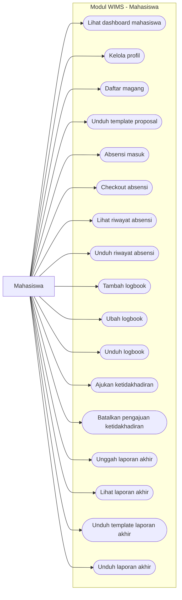
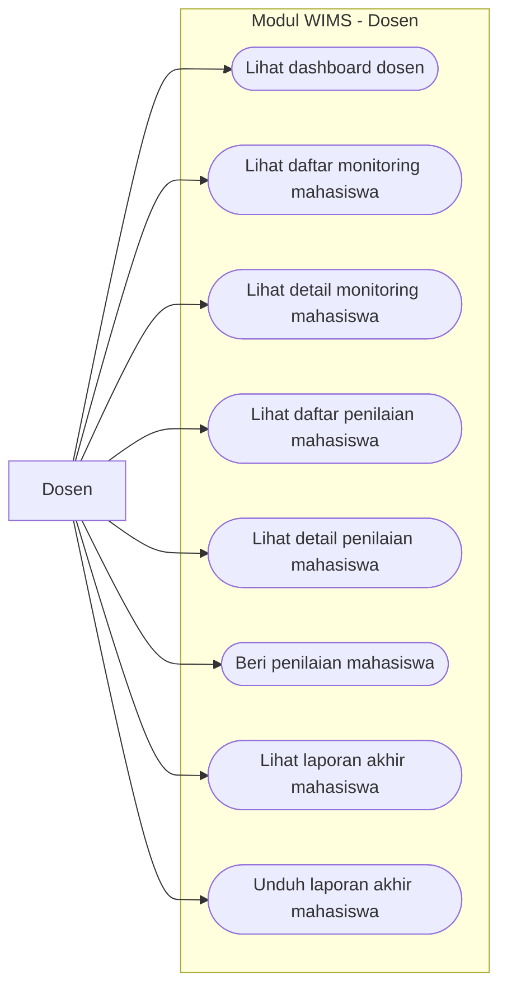
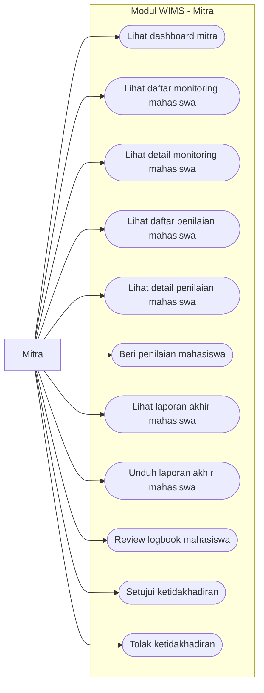
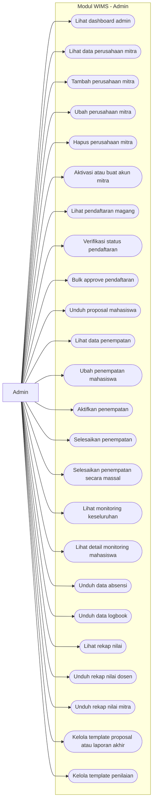

# Use Case Diagram WIMS

Dokumen ini merangkum use case diagram untuk modul **WIMS (Web-based Internship Management System)** berdasarkan implementasi lokal pada repo saat ini.

## Aktor Utama

- Mahasiswa
- Dosen
- Mitra
- Admin

Catatan:
- Role `Admin` pada implementasi portal mencakup `super-admin`, `admin`, `admin-universitas`, `admin-akademik`, dan `prodi`.
- Diagram berikut disusun dari fitur yang tersedia pada `routes/wims.php` dan struktur modul `app/Modules/Wims/`.

## 1. Use Case Diagram Keseluruhan

```mermaid
flowchart LR
    mahasiswa[Mahasiswa]
    dosen[Dosen]
    mitra[Mitra]
    admin[Admin]

    subgraph WIMS["Sistem WIMS"]
        uc1([Kelola profil mahasiswa])
        uc2([Daftar magang])
        uc3([Unduh template proposal])
        uc4([Lakukan absensi masuk])
        uc5([Lakukan checkout absensi])
        uc6([Lihat dan unduh riwayat absensi])
        uc7([Kelola logbook harian])
        uc8([Unduh logbook])
        uc9([Ajukan ketidakhadiran])
        uc10([Unggah laporan akhir])
        uc11([Lihat dan unduh laporan akhir])
        uc12([Lihat dashboard per role])
        uc13([Monitoring mahasiswa])
        uc14([Lihat detail monitoring])
        uc15([Beri penilaian mahasiswa])
        uc16([Review logbook mahasiswa])
        uc17([Setujui atau tolak ketidakhadiran])
        uc18([Kelola data perusahaan mitra])
        uc19([Aktivasi akun mitra])
        uc20([Verifikasi pendaftaran magang])
        uc21([Unduh proposal mahasiswa])
        uc22([Kelola penempatan mahasiswa])
        uc23([Aktifkan atau selesaikan penempatan])
        uc24([Monitoring keseluruhan])
        uc25([Unduh data absensi dan logbook])
        uc26([Kelola template laporan akhir])
        uc27([Kelola template penilaian])
        uc28([Lihat dan unduh rekap nilai])
    end

    mahasiswa --> uc1
    mahasiswa --> uc2
    mahasiswa --> uc3
    mahasiswa --> uc4
    mahasiswa --> uc5
    mahasiswa --> uc6
    mahasiswa --> uc7
    mahasiswa --> uc8
    mahasiswa --> uc9
    mahasiswa --> uc10
    mahasiswa --> uc11
    mahasiswa --> uc12

    dosen --> uc12
    dosen --> uc13
    dosen --> uc14
    dosen --> uc15
    dosen --> uc11

    mitra --> uc12
    mitra --> uc13
    mitra --> uc14
    mitra --> uc15
    mitra --> uc16
    mitra --> uc17
    mitra --> uc11

    admin --> uc12
    admin --> uc18
    admin --> uc19
    admin --> uc20
    admin --> uc21
    admin --> uc22
    admin --> uc23
    admin --> uc24
    admin --> uc25
    admin --> uc26
    admin --> uc27
    admin --> uc28
end
```

## 2. Use Case Diagram Mahasiswa



## 3. Use Case Diagram Dosen



## 4. Use Case Diagram Mitra



## 5. Use Case Diagram Admin



## 6. Narasi Singkat Untuk Skripsi

Narasi yang bisa dipakai:

> Use case diagram modul WIMS menggambarkan interaksi empat aktor utama, yaitu mahasiswa, dosen, mitra, dan admin, dengan sistem pengelolaan magang berbasis web. Mahasiswa berfokus pada proses operasional magang seperti pendaftaran, absensi, logbook, ketidakhadiran, dan laporan akhir. Dosen dan mitra berperan dalam monitoring serta penilaian mahasiswa, sedangkan admin mengelola aspek administratif seperti perusahaan mitra, verifikasi pendaftaran, penempatan, monitoring keseluruhan, template dokumen, dan rekap nilai.

## 7. Referensi Implementasi

- `routes/wims.php`
- `app/Modules/Wims/Controllers/`
- `app/Modules/Wims/Services/`
- `docs/wims-product-documentation.md`

